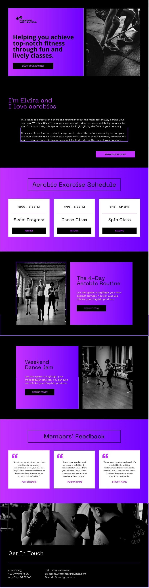

## Elvira-website

This is simple responsive website for a fitness instructor highlighting available services, schedules, and contact information. The entire design is from [Canva's free template library](https://www.canva.com/).

## Design

### Built with

- Semantic HTML5 markup
- Sass
- Flexbox
- Mobile-first workflow
- CSS BEM architecture
- JavaScript

## Contributing

Pull requests are welcome. For major changes, please open an issue first to discuss what you would like to change.

1. Clone repo and create a new branch: `$ git checkout https://github.com/alvyynm/Elvira-website -b name_for_new_branch`.
2. Make changes and test
3. Submit Pull Request with comprehensive description of changes

## Acknowledgements

- [Canva](https://www.canva.com/) -- for the design template
- [Flaticon](https://www.flaticon.com/) -- for all the icons used in the project.

## License

[MIT](https://github.com/alvyynm/Elvira-website/blob/main/LICENSE)
